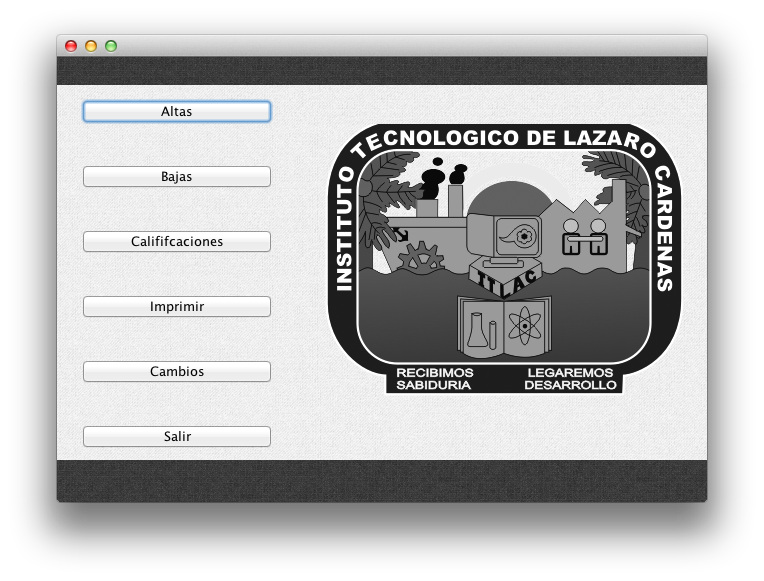
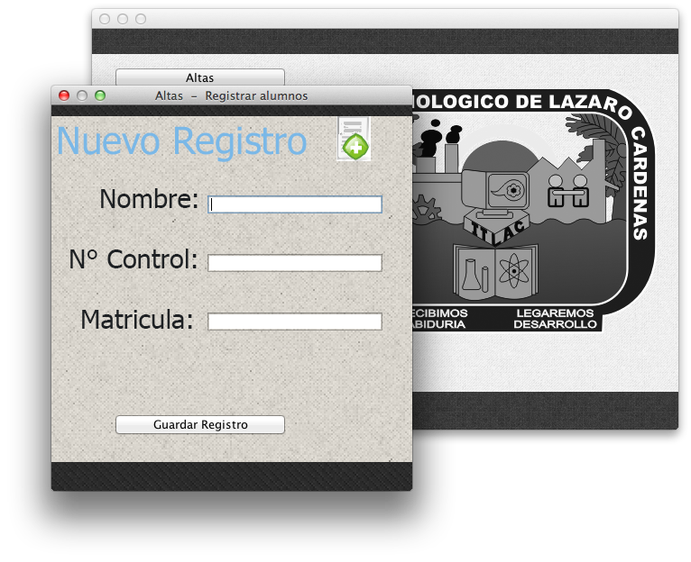
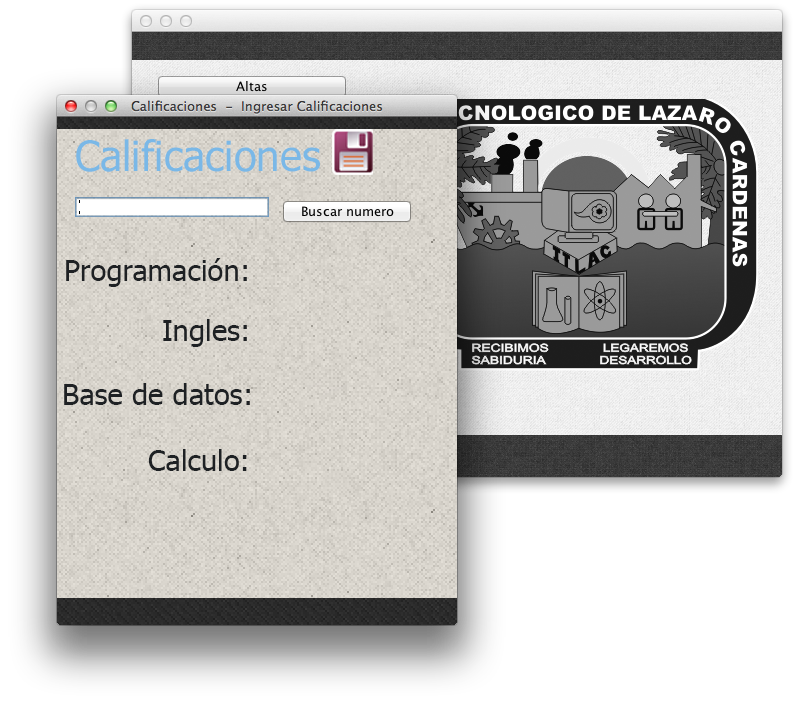
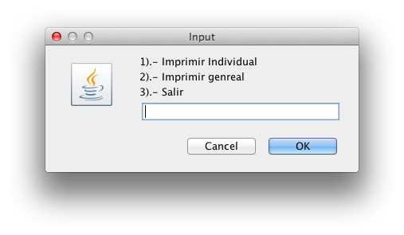

EscuelaLinux
============

Proyecto construido en JAVA para el control de un grupo escolar, creado inicialmente en el SO Ubuntu

+ Menu principal

+ Modulo de altas

+ Modulo de bajas

+ Modulo de calificaciones

+ Modulo para imprimir en cosola

